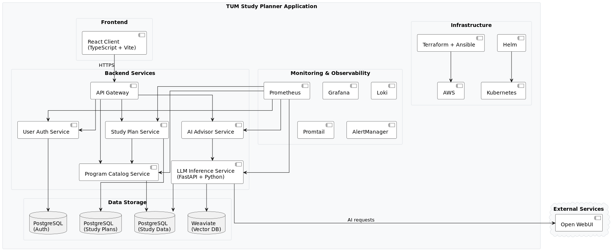

# 📖 TUM Study Planner

Planning a study program at TUM can be overwhelming. Students often struggle with:

- **Information Overload**: Navigating through hundreds of courses across different departments and semesters
- **Complex Prerequisites**: Understanding which courses need to be completed before others
- **Planning Uncertainty**: Not knowing which courses align with their career goals or interests
- **Time Management**: Organizing courses efficiently across semesters to graduate on time
- **Lack of Guidance**: Limited access to personalized academic advice when needed

Our TUM Study Planner solves these challenges by providing an intelligent, all-in-one platform that guides students through their entire academic journey.

#### ✏️ Student Registration

Getting started is effortless. Students create an account using their email and a password – that’s it. From there, they’re welcomed to explore the course catalog, create study plans and get AI-Powered assistance.

#### 🔍 Explore Course Catalog

No more getting lost in PDFs or scattered links. Our platform offers a powerful, searchable catalog of all TUM courses (currently only MSc Information System courses), neatly organized by programs and departments. Whether you’re curious about Machine Learning, Algorithms, or Digital Ethics, students can search intuitively, filter by requirements, and dive into module details: credits, prerequisites, semesters offered, and more. The entire academic landscape is just a few clicks away.

#### 📚 Smart Study Plan Creation

Building a degree plan has never been easier. Students can design their own semester-by-semester roadmap, check off prerequisites, and monitor progress toward graduation – all visually and interactively. Multiple study plan scenarios? Absolutely. Real-time validation ensures every plan is realistic, rule-compliant, and tailored to each student’s goals.

#### 🤖 AI-Powered Course Assistance

Meet your 24/7 academic co-pilot. Our AI assistant understands TUM’s curriculum and gives intelligent answers in natural language:
“What’s the difference between the two Machine Learning electives?”
“What path should I take if I want to become a data scientist?”
Backed by deep content analysis and confidence scores, the AI suggests optimal course sequences, explains prerequisites, and helps students plan smarter.

## 🚀 Quick Start - One-Command Deployment

Deploy the complete application stack with a single command:

Prerequisite: Get the .env file from project team
```bash
# 1. Clone and navigate to project
git clone https://github.com/AET-DevOps25/team-stratton-oakmont.git
cd team-stratton-oakmont

# 2. Compose docker
docker network create stratton-oakmont-network
docker-compose -f docker-compose.monitoring.yml up -d
docker-compose -f docker-compose.test.yml up -d --build

# 3. Forward ports for weaviate (.kube config from rancher needed)
kubectl port-forward -n tum-study-planner svc/weaviate-vector-service 8000:8000 50051:50051

# Wait ~2 minutes for all services to start, then access:
# 🌐 Application: http://localhost:3000
```

## 🏗️ Architecture Overview

The TUM Study Planner follows a modern microservices architecture with AI integration:

### System Architecture Overview

- 🎯 [**Use Case Diagram**](./project-documentation/system-overview/use_case_diagram.pdf) - User interactions and system capabilities
  

- 📋 [**Top-Level Architecture**](./project-documentation/system-overview/top_level_architecture.pdf) - Complete system overview and component relationships
  

- 📊 [**Analysis Object Model**](./project-documentation/system-overview/Analysis_Object_Model.pdf) - Data models and business logic structure
  

### Tech Stack

- **Frontend**: React + TypeScript + Vite + Material-UI
- **Backend**: Spring Boot (Java) + FastAPI (Python)
- **AI/ML**: Open WebUI + LangChain + Weaviate Vector DB
- **Database**: PostgreSQL + Vector Database (Weaviate)
- **Infrastructure**: Docker + Docker Compose
- **Monitoring**: Prometheus + Grafana + Loki + Promtail

## 🤖 GenAI Integration

### Retrieval-Augmented Generation (RAG) Pipeline

The system implements a sophisticated RAG architecture for intelligent course assistance:

#### Core AI Capabilities

- **Natural Language Understanding**: Parse complex student queries about academic planning
- **Semantic Course Search**: Vector-based similarity search across TUM course catalog
- **Contextual Response Generation**: GPT-powered responses with course-specific context
- **Course Code Detection**: Automatic identification and linking of course references
- **Confidence Scoring**: Reliability assessment for AI-generated responses

#### Technical Implementation


#### Example AI Interactions

- **"What programming languages are used in IN0001?"** → Identifies course, retrieves content, provides specific language information
- **"I want to study machine learning. What courses should I take?"** → Multi-course recommendations with prerequisites and sequences
- **"What are the prerequisites for Advanced Algorithms?"** → Prerequisite analysis with academic planning guidance

## 🛠️ Development & Deployment

### 🔧 Environment Setup

#### Required Environment Variables

```bash
# Database Configuration
DB_STUDY_DATA_URL=jdbc:postgresql://localhost:5432/study_data
DB_STUDY_PLAN_URL=jdbc:postgresql://localhost:5432/study_plan
DB_USER_AUTH_URL=jdbc:postgresql://localhost:5432/user_auth

# Security
JWT_SECRET=your-256-bit-secret-key

# AI Configuration (Optional - for AI features)
OPENAI_API_KEY=your-openai-api-key
WEAVIATE_URL=http://localhost:8000
```

### Quick Local Development Setup

```bash
# Start databases only
docker-compose -f docker-compose.test.yml up -d postgres-study-data postgres-study-plan postgres-user-auth weaviate

# Start individual services for development
cd server
./gradlew :program-catalog-service:bootRun &
./gradlew :study-plan-service:bootRun &
./gradlew :ai-advisor-service:bootRun &
./gradlew :user-auth-service:bootRun &

cd ../server/llm-inference-service
pip install -r requirements.txt
python main.py &

cd ../../client
npm install && npm run dev
```

### Production Deployment

```bash
# Local production deployment
./scripts/deploy-with-monitoring.sh

# AWS deployment
./scripts/deploy.sh

# Cleanup
./scripts/destroy-with-monitoring.sh
```

### Service URLs

| Service         | Local URL             | API Documentation                                          |
| --------------- | --------------------- | ---------------------------------------------------------- |
| Frontend        | http://localhost:3000 | User Interface                                             |
| Program Catalog | http://localhost:8080 | [Swagger UI](http://localhost:8080/api/v1/swagger-ui.html) |
| Study Plan      | http://localhost:8081 | [Swagger UI](http://localhost:8081/api/v1/swagger-ui.html) |
| AI Advisor      | http://localhost:8082 | [Swagger UI](http://localhost:8082/api/v1/swagger-ui.html) |
| User Auth       | http://localhost:8083 | [Swagger UI](http://localhost:8083/api/v1/swagger-ui.html) |
| LLM Service     | http://localhost:8084 | FastAPI Auto-docs                                          |
| Monitoring      | http://localhost:3001 | Grafana Dashboards                                         |

### Monitoring & Observability

- **Prometheus**: Metrics collection from all services
- **Grafana**: Real-time dashboards and alerting
- **Loki**: Centralized log aggregation
- **Health Checks**: Automated service health monitoring

- 📊 [**Monitoring Setup**](./monitoring/README.md) - Observability configuration

## 📚 Documentation

### Service Documentation

- 🔧 [**Backend Services Overview**](./server/README.md) - Complete backend architecture and setup
- 📖 [**Program Catalog Service**](./server/program-catalog-service/README.md)
- 📖 [**Study Plan Service**](./server/study-plan-service/README.md)
- 📖 [**AI Advisor Service**](./server/ai-advisor-service/README.md)
- 📖 [**User Auth Service**](./server/user-auth-service/README.md)
- 📖 [**LLM Inference Service**](./server/llm-inference-service/README.md)

## 👥 Student Responsibilities & Project Mapping

This project was developed by Team Stratton Oakmont as part of the DevOps course. Here's the clear mapping of student responsibilities:

### Team Contributions

**Johannes Guegel** spearheaded data acquisition through comprehensive tumonline website scraping and implemented the complete monitoring stack (prometheus, promtail, loki, grafana, alertmanager). He developed the complex study-plan-service that enables to create and configure a study plan and track progress.

**Florian Seitz** architected the DevOps pipeline, managing Kubernetes deployments, AWS workflows, Docker containerization, and GitHub Actions CI/CD. He created the intelligent AI course chat system using Weaviate vector databases and LangChain integration.

**Nikolas Lethaus** built the core backend services architecture, implementing secure user authentication and designing the intuitive purple-themed frontend interface. He developed comprehensive API documentation, service testing frameworks, and the complete program catalog system.

### Prerequisites

- Docker & Docker Compose
- Java 17+ (for local development)
- Python 3.9+ (for AI service development)
- Node.js 18+ (for frontend development)

## 📄 License

MIT License - See [LICENSE](./LICENSE) file for details.

---

**Team Stratton Oakmont** - DevOps Engineering Course, Technical University Munich
