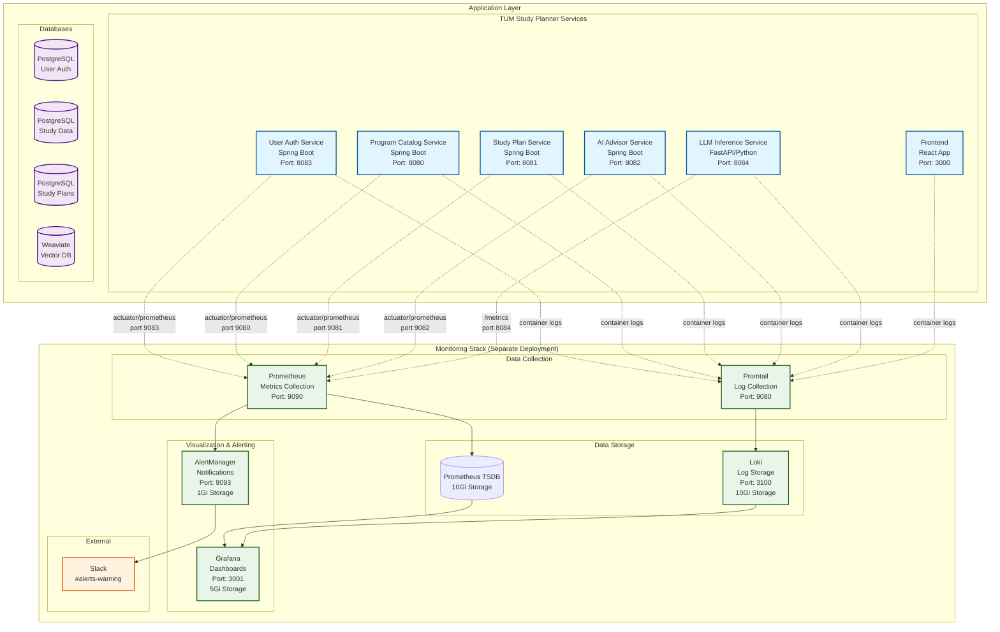

# 🔍 TUM Study Planner - Monitoring & Observability Stack

This comprehensive guide covers the complete monitoring and observability stack for the TUM Study Planner application, including metrics collection, log aggregation, visualization, and alerting.

## 📋 Table of Contents

- [Architecture Overview](#architecture-overview)
- [Data Flow](#data-flow)
- [Service Metrics](#service-metrics)
- [Getting Started](#getting-started)
- [Local Development](#local-development)
- [Kubernetes Deployment](#kubernetes-deployment)
- [Web Interfaces](#web-interfaces)
- [Why Separate Monitoring Stack](#why-separate-monitoring-stack)
- [Configuration Details](#configuration-details)
- [Alerting](#alerting)
- [Troubleshooting](#troubleshooting)

## 🏗️ Architecture Overview

The monitoring stack follows a layered architecture designed for comprehensive observability of microservices:



### 🔧 Stack Components

| Component        | Technology             | Purpose                                | Storage | Network               |
| ---------------- | ---------------------- | -------------------------------------- | ------- | --------------------- |
| **Prometheus**   | Time-Series DB         | Metrics collection, storage & alerting | 10Gi PV | Internal scraping     |
| **Grafana**      | Visualization Platform | Dashboards, charts, and analytics      | 5Gi PV  | Web interface         |
| **Loki**         | Log Aggregation        | Centralized log storage and querying   | 10Gi PV | Log ingestion         |
| **Promtail**     | Log Forwarder          | Collects and ships container logs      | -       | Log collection        |
| **AlertManager** | Alert Router           | Routes and manages alerts to Slack     | 1Gi PV  | Notification delivery |

## 🌊 Data Flow

### 1. Metrics Collection Flow

```
Application Services → Metrics Endpoints → Prometheus → Time-Series Storage
                                                    ↓
                                              Alert Rules Evaluation
                                                    ↓
                                              AlertManager → Slack
```

**Detailed Metrics Flow:**

1. **Spring Boot Services** expose metrics via Actuator endpoints (`/actuator/prometheus`)
2. **LLM Service** exposes metrics via custom endpoint (`/metrics`)
3. **Prometheus** scrapes all endpoints every 5-15 seconds
4. **Metrics** are stored in Prometheus time-series database
5. **Alert Rules** are continuously evaluated against metrics
6. **AlertManager** receives firing alerts and routes to Slack

### 2. Log Collection Flow

```
Container Logs → Promtail → Loki → Grafana Dashboard
            ↓
    Docker/Kubernetes Log Files
```

**Detailed Log Flow:**

1. **Applications** write logs to stdout/stderr
2. **Container Runtime** captures logs to files
3. **Promtail** tails log files and processes them
4. **Pipeline Processing** extracts metadata (container name, timestamp)
5. **Loki** receives and indexes logs by labels
6. **Grafana** queries Loki for log visualization

### 3. Visualization Flow

```
Prometheus (Metrics) ──┐
                       ├──→ Grafana → Web Dashboard
Loki (Logs) ───────────┘
```

## 📊 Service Metrics

### Spring Boot Services (Java/Gradle)

All Spring Boot services expose comprehensive metrics via **Spring Boot Actuator**:

#### 🔧 **Program Catalog Service** (Port 8080, Management 9080)

```yaml
Endpoints: /actuator/prometheus
Metrics Collected:
  # HTTP Metrics
  - http_server_requests_seconds_count: Request count by endpoint
  - http_server_requests_seconds_sum: Total request duration
  - http_server_requests_seconds_max: Maximum request time

  # JVM Metrics
  - jvm_memory_used_bytes: JVM memory usage by area
  - jvm_gc_pause_seconds: Garbage collection pause times
  - jvm_threads_live_threads: Active thread count

  # Application Metrics
  - application_started_time_seconds: Application startup time
  - application_ready_time_seconds: Application ready time

  # System Metrics
  - system_cpu_usage: System CPU utilization
  - process_cpu_usage: Process CPU utilization
  - disk_free_bytes: Available disk space
```

#### 👤 **User Auth Service** (Port 8083, Management 9083)

```yaml
Additional Metrics:
  # Authentication Specific
  - custom_auth_attempts_total: Authentication attempts
  - custom_jwt_tokens_issued_total: JWT tokens issued
  - custom_active_sessions: Active user sessions

  # Database Connection Pool
  - hikaricp_connections_active: Active DB connections
  - hikaricp_connections_idle: Idle DB connections
  - hikaricp_connections_pending: Pending connections
```

#### 📚 **Study Plan Service** (Port 8081, Management 9081)

```yaml
Additional Metrics:
  # Study Plan Specific
  - custom_study_plans_created_total: Study plans created
  - custom_course_enrollments_total: Course enrollments
  - custom_plan_modifications_total: Plan modifications
```

#### 🤖 **AI Advisor Service** (Port 8082, Management 9082)

```yaml
Additional Metrics:
  # AI Service Specific
  - custom_ai_requests_total: AI advice requests
  - custom_ai_response_time_seconds: AI response times
  - custom_recommendations_generated_total: Recommendations generated
```

### Python Service (FastAPI)

#### 🧠 **LLM Inference Service** (Port 8084, Metrics `/metrics`)

```yaml
Technology: FastAPI + prometheus_client
Metrics Collected:
  # Custom HTTP Metrics
  - http_requests_total: HTTP requests by method, endpoint, status
  - http_request_duration_seconds: Request duration histogram

  # Python Runtime Metrics
  - python_gc_objects_collected_total: Garbage collection stats
  - python_gc_objects_uncollectable_total: Uncollectable objects
  - python_info: Python interpreter information

  # Process Metrics
  - process_virtual_memory_bytes: Virtual memory usage
  - process_resident_memory_bytes: Resident memory usage
  - process_start_time_seconds: Process start time
  - process_cpu_seconds_total: CPU time consumed

  # Custom AI Metrics (when implemented)
  - llm_inference_requests_total: LLM inference requests
  - llm_inference_duration_seconds: LLM response times
  - vector_search_duration_seconds: Vector search performance
```

## 🚀 Getting Started

### Prerequisites

Choose your deployment method:

**For Local Development:**

- Docker & Docker Compose
- 8GB+ RAM recommended

**For Kubernetes:**

- Kubernetes cluster access
- `kubectl` configured
- 16GB+ cluster capacity recommended

## 💻 Local Development

### Quick Start (5 minutes)

```bash
# Clone repository
git clone https://github.com/AET-DevOps25/team-stratton-oakmont.git
cd team-stratton-oakmont

# Create shared network (one-time setup)
docker network create stratton-oakmont-network

# Start monitoring stack (independent, persistent)
docker-compose -f docker-compose.monitoring.yml up -d

# Start application services
docker-compose -f docker-compose.test.yml up -d --build
```

### Verification Commands

```bash
# Check all containers are running
docker ps --format "table {{.Names}}\t{{.Status}}\t{{.Ports}}"

# Test Prometheus targets (should show all 6 services)
curl -s http://localhost:9090/api/v1/targets | jq '.data.activeTargets[].health'

# Test metrics endpoints for all services
curl -s http://localhost:9080/actuator/prometheus | head -5  # Program Catalog
curl -s http://localhost:9081/actuator/prometheus | head -5  # Study Plan
curl -s http://localhost:9082/actuator/prometheus | head -5  # AI Advisor
curl -s http://localhost:9083/actuator/prometheus | head -5  # User Auth
curl -s http://localhost:8084/metrics | head -5             # LLM Inference

# Check Grafana health
curl -s http://localhost:3001/api/health
```

### Local URLs & Access

| Service        | URL                   | Credentials | Purpose                    |
| -------------- | --------------------- | ----------- | -------------------------- |
| **Grafana**    | http://localhost:3001 | admin/admin | Dashboards & visualization |
| **Prometheus** | http://localhost:9090 | None        | Metrics & alerts           |
| **Loki**       | http://localhost:3100 | None        | Log API                    |
| **Promtail**   | http://localhost:9084 | None        | Log collector status       |

## ☸️ Kubernetes Deployment

### Production Deployment

```bash
# Deploy monitoring stack to Kubernetes
./scripts/deploy-monitoring.sh

# Verify deployment
kubectl get pods -n tum-study-planner-monitoring
kubectl get pv | grep monitoring
```

### Access Services via Port Forwarding

```bash
# Grafana (Dashboards)
kubectl port-forward -n tum-study-planner-monitoring svc/grafana 3001:3000
# Access: http://localhost:3001

# Prometheus (Metrics)
kubectl port-forward -n tum-study-planner-monitoring svc/prometheus 9090:9090
# Access: http://localhost:9090

# Loki (Logs API)
kubectl port-forward -n tum-study-planner-monitoring svc/loki 3100:3100
# Access: http://localhost:3100

# AlertManager (Alert Status)
kubectl port-forward -n tum-study-planner-monitoring svc/alertmanager 9093:9093
# Access: http://localhost:9093
```

### Health Check Commands

```bash
# Check monitoring stack health
kubectl get pods -n tum-study-planner-monitoring

# Check application services
kubectl get pods -n tum-study-planner

# View logs
kubectl logs -f deployment/prometheus -n tum-study-planner-monitoring
kubectl logs -f deployment/grafana -n tum-study-planner-monitoring
```

## 🌐 Web Interfaces

### 📊 Grafana Dashboard (Port 3001)

**URL:** `http://localhost:3001`  
**Credentials:** `admin/admin` (change on first login)

**Available Dashboards:**

- **Application Overview:** Service health, response times, throughput
- **JVM Metrics:** Memory usage, GC performance, thread counts
- **HTTP Metrics:** Request rates, error rates, latency percentiles
- **System Metrics:** CPU, memory, disk usage
- **Log Explorer:** Centralized log search and filtering

**Pre-configured Data Sources:**

- **Prometheus:** `http://prometheus:9090` (metrics)
- **Loki:** `http://loki:3100` (logs)

**Useful Queries:**

```promql
# Service uptime (all 6 services)
up{job=~".*-service"}

# Request rate per service
rate(http_server_requests_seconds_count{job=~".*-service"}[5m])

# LLM service request rate (Python FastAPI)
rate(http_requests_total{job="llm-inference-service"}[5m])

# 95th percentile response time (Spring Boot services)
histogram_quantile(0.95, rate(http_server_requests_seconds_bucket{job=~".*-service"}[5m]))

# 95th percentile response time (LLM service)
histogram_quantile(0.95, rate(http_request_duration_seconds_bucket{job="llm-inference-service"}[5m]))

# Error rate (Spring Boot services)
rate(http_server_requests_seconds_count{job=~".*-service",status=~"5.."}[5m])

# Error rate (LLM service)
rate(http_requests_total{job="llm-inference-service",status=~"5.."}[5m])

# JVM memory usage by service
jvm_memory_used_bytes{job=~".*-service",area="heap"}

# Database connection health
hikaricp_connections_active{job=~".*-service"}

# Service-specific business metrics
# User Auth: Login attempts
increase(http_server_requests_seconds_count{job="user-auth-service",uri="/auth/login"}[1h])

# Program Catalog: Course queries
increase(http_server_requests_seconds_count{job="program-catalog-service",uri=~"/api/v1/courses.*"}[1h])

# Study Plan: Plan operations
increase(http_server_requests_seconds_count{job="study-plan-service",uri=~"/api/v1/study-plans.*"}[1h])

# AI Advisor: AI requests
increase(http_server_requests_seconds_count{job="ai-advisor-service",uri=~"/api/v1/advice.*"}[1h])

# LLM Inference: Chat interactions
increase(http_requests_total{job="llm-inference-service",endpoint="/chat/"}[1h])
```

### 🎯 Prometheus UI (Port 9090)

**URL:** `http://localhost:9090`  
**No Authentication Required**

**Key Sections:**

- **Targets:** `/targets` - Service discovery and health status
- **Rules:** `/rules` - Alert rule status and evaluation
- **Alerts:** `/alerts` - Currently firing alerts
- **Graph:** `/graph` - Query interface and visualization

**Essential Queries:**

```promql
# Check all services are up (should show 6 services)
up == 1

# Memory usage by service
jvm_memory_used_bytes{area="heap",job=~".*-service"}

# Database connection pools (all Spring Boot services)
hikaricp_connections_active{job=~".*-service"}

# Request latency by percentile (all services)
histogram_quantile(0.99, http_server_requests_seconds_bucket{job=~".*-service"})

# Service-specific queries
# Program Catalog Service requests
rate(http_server_requests_seconds_count{job="program-catalog-service"}[5m])

# User Auth Service authentication metrics
rate(http_server_requests_seconds_count{job="user-auth-service",uri="/auth/login"}[5m])

# Study Plan Service activity
rate(http_server_requests_seconds_count{job="study-plan-service"}[5m])

# AI Advisor Service performance
rate(http_server_requests_seconds_count{job="ai-advisor-service"}[5m])

# LLM Inference Service (Python/FastAPI)
rate(http_requests_total{job="llm-inference-service"}[5m])
```

### 📝 Loki API (Port 3100)

**URL:** `http://localhost:3100`  
**API-Only Interface**

**Health Endpoints:**

- `/ready` - Loki readiness status
- `/metrics` - Loki internal metrics

**Query API:**

- `/loki/api/v1/query` - Instant log queries
- `/loki/api/v1/query_range` - Range log queries

**Example Queries (via Grafana):**

```logql
# All logs from a specific service
{container_name="program-catalog-service"}

# Error logs across all services
{container_name=~".*-service"} |= "ERROR"

# Authentication failures
{container_name="user-auth-service"} |= "authentication failed"
```

### 🚨 AlertManager UI (Port 9093)

**URL:** `http://localhost:9093`  
**No Authentication Required**

**Sections:**

- **Alerts:** Current alert status
- **Silences:** Muted alerts
- **Status:** AlertManager configuration and clustering

## 🔄 Why Separate Monitoring Stack?

### 🎯 **Design Rationale**

We chose a **separate monitoring stack** deployment for several critical reasons:

#### 1. **🏗️ Infrastructure Isolation**

```yaml
Application Stack (Ephemeral):
  - Can be deployed/destroyed frequently
  - Development iterations don't affect monitoring
  - Testing environments remain observable

Monitoring Stack (Persistent):
  - Always available for debugging
  - Historical data preserved across deployments
  - Independent scaling and resource allocation
```

#### 2. **📈 Data Persistence & Historical Analysis**

- **Continuous Monitoring:** Metrics collection continues even when applications are down
- **Long-term Trends:** Historical data for capacity planning and performance analysis
- **Root Cause Analysis:** Ability to investigate issues that occurred during downtime
- **Compliance:** Audit trails and monitoring data retention

#### 3. **🔒 Security & Access Control**

```yaml
Monitoring Network Isolation:
  - Management endpoints not exposed externally
  - Prometheus scrapes via internal network
  - Separate namespace with RBAC controls
  - Monitoring team access independent of app teams
```

#### 4. **⚡ Performance & Resource Management**

- **Dedicated Resources:** Monitoring doesn't compete with application resources
- **Optimized Storage:** Different storage classes for metrics vs application data
- **Independent Scaling:** Scale monitoring based on metrics volume, not application load

#### 5. **🛠️ Operational Benefits**

```yaml
Deployment Independence:
  - Update monitoring without touching applications
  - Deploy applications without affecting monitoring
  - Different release cycles and maintenance windows
  - Simplified disaster recovery procedures
```

#### 6. **🔧 Multi-Environment Support**

```yaml
Single Monitoring Stack can observe:
  - Development environment
  - Staging environment
  - Production environment
  - Testing deployments
```

### 📊 **Resource Allocation Strategy**

```yaml
Monitoring Stack Resources (Kubernetes):
  Prometheus:
    CPU: 500m-2000m
    Memory: 2Gi-8Gi
    Storage: 10Gi-100Gi (based on retention)

  Grafana:
    CPU: 100m-500m
    Memory: 512Mi-2Gi
    Storage: 5Gi (dashboards, users)

  Loki:
    CPU: 500m-1000m
    Memory: 1Gi-4Gi
    Storage: 10Gi-500Gi (based on log volume)

  Total Overhead: ~15-20% of application resources
```

## ⚙️ Configuration Details

### Prometheus Configuration

**Scrape Configuration:** (`monitoring/prometheus/prometheus.yml`)

```yaml
global:
  scrape_interval: 15s # Default scraping interval
  evaluation_interval: 15s # Alert rule evaluation

scrape_configs:
  # Prometheus self-monitoring
  - job_name: "prometheus"
    static_configs:
      - targets: ["localhost:9090"]

  # Spring Boot Services (Actuator endpoints)
  - job_name: "program-catalog-service"
    static_configs:
      - targets: ["program-catalog-service:9080"]
    metrics_path: "/actuator/prometheus"
    scrape_interval: 5s

  - job_name: "study-plan-service"
    static_configs:
      - targets: ["study-plan-service:9081"]
    metrics_path: "/actuator/prometheus"
    scrape_interval: 5s

  - job_name: "ai-advisor-service"
    static_configs:
      - targets: ["ai-advisor-service:9082"]
    metrics_path: "/actuator/prometheus"
    scrape_interval: 5s

  - job_name: "user-auth-service"
    static_configs:
      - targets: ["user-auth-service:9083"]
    metrics_path: "/actuator/prometheus"
    scrape_interval: 5s

  # FastAPI Service (Custom metrics)
  - job_name: "llm-inference-service"
    static_configs:
      - targets: ["llm-inference-service:8084"]
    metrics_path: "/metrics"
    scrape_interval: 5s
```

### Grafana Data Sources

**Auto-provisioned:** (`monitoring/grafana/provisioning/datasources/datasources.yml`)

```yaml
datasources:
  - name: Prometheus
    type: prometheus
    url: http://prometheus:9090
    isDefault: true

  - name: Loki
    type: loki
    url: http://loki:3100
```

### Loki Configuration

**Log Storage:** (`monitoring/loki/loki-config.yml`)

```yaml
server:
  http_listen_port: 3100

storage:
  filesystem:
    chunks_directory: /tmp/loki/chunks
    rules_directory: /tmp/loki/rules

schema_config:
  configs:
    - from: 2020-10-24
      store: boltdb-shipper
      object_store: filesystem
      schema: v11
```

### Promtail Log Collection

**Container Log Processing:** (`monitoring/promtail/promtail.yml`)

```yaml
scrape_configs:
  - job_name: containers
    static_configs:
      - targets: [localhost]
        labels:
          job: containerlogs
          __path__: /var/lib/docker/containers/*/*-json.log

    pipeline_stages:
      - json:
          expressions:
            output: log
            stream: stream
      - labels:
          container_name:
```

## 🚨 Alerting

### Configured Alert Rules

| Alert Name                  | Service                 | Condition                                                                                                                                                                                                                                   | Duration  | Severity | Description                    |
| --------------------------- | ----------------------- | ------------------------------------------------------------------------------------------------------------------------------------------------------------------------------------------------------------------------------------------- | --------- | -------- | ------------------------------ |
| **ServiceDown**             | All Services            | `up{job=~".*-service"} == 0`                                                                                                                                                                                                                | 1 minute  | Critical | Service completely unavailable |
| **HighResponseTime**        | Spring Boot Services    | `rate(http_server_requests_seconds_sum{job=~"(user-auth\|program-catalog\|study-plan\|ai-advisor)-service"}[5m]) / rate(http_server_requests_seconds_count{job=~"(user-auth\|program-catalog\|study-plan\|ai-advisor)-service"}[5m]) > 0.5` | 2 minutes | Warning  | Response time > 500ms          |
| **LLMHighResponseTime**     | LLM Inference Service   | `rate(http_request_duration_seconds_sum{job="llm-inference-service"}[5m]) / rate(http_request_duration_seconds_count{job="llm-inference-service"}[5m]) > 1.0`                                                                               | 2 minutes | Warning  | LLM response time > 1s         |
| **HighErrorRate**           | Spring Boot Services    | `rate(http_server_requests_seconds_count{job=~".*-service",status=~"5.."}[5m]) / rate(http_server_requests_seconds_count{job=~".*-service"}[5m]) > 0.1`                                                                                     | 2 minutes | Warning  | Error rate > 10%               |
| **LLMHighErrorRate**        | LLM Inference Service   | `rate(http_requests_total{job="llm-inference-service",status=~"5.."}[5m]) / rate(http_requests_total{job="llm-inference-service"}[5m]) > 0.1`                                                                                               | 2 minutes | Warning  | LLM error rate > 10%           |
| **HighMemoryUsage**         | Spring Boot Services    | `jvm_memory_used_bytes{job=~".*-service",area="heap"} / jvm_memory_max_bytes{job=~".*-service",area="heap"} > 0.8`                                                                                                                          | 5 minutes | Warning  | JVM heap usage > 80%           |
| **DatabaseConnectionIssue** | Database-using Services | `hikaricp_connections_active{job=~"(user-auth\|program-catalog\|study-plan)-service"} == 0`                                                                                                                                                 | 2 minutes | Critical | No active database connections |
| **AuthServiceHighLoad**     | User Auth Service       | `rate(http_server_requests_seconds_count{job="user-auth-service",uri="/auth/login"}[5m]) > 50`                                                                                                                                              | 5 minutes | Warning  | Login attempts > 50/min        |
| **LLMServiceHighLoad**      | LLM Inference Service   | `rate(http_requests_total{job="llm-inference-service",endpoint="/chat/"}[5m]) > 20`                                                                                                                                                         | 5 minutes | Warning  | Chat requests > 20/min         |
| **DiskSpaceLow**            | All Services            | `(node_filesystem_avail_bytes / node_filesystem_size_bytes) < 0.1`                                                                                                                                                                          | 1 minute  | Critical | Available disk space < 10%     |

### Slack Integration Setup

1. **Create Slack App:**

   - Go to https://api.slack.com/apps
   - Create app for your workspace
   - Enable Incoming Webhooks

2. **Configure AlertManager:**

```bash
# Set webhook URL as secret
kubectl create secret generic alertmanager-secrets \
  --namespace=tum-study-planner-monitoring \
  --from-literal=slack-webhook-url="YOUR_WEBHOOK_URL"

# Apply configuration
kubectl apply -f k8s/monitoring/alertmanager.yaml
```

3. **Test Alerts:**

```bash
# Test service down alert (Program Catalog Service)
kubectl scale deployment program-catalog-service --replicas=0 -n tum-study-planner
# Wait 2 minutes, then restore
kubectl scale deployment program-catalog-service --replicas=1 -n tum-study-planner

# Test service down alert (User Auth Service)
kubectl scale deployment user-auth-service --replicas=0 -n tum-study-planner
# Wait 2 minutes, then restore
kubectl scale deployment user-auth-service --replicas=1 -n tum-study-planner

# Test service down alert (LLM Inference Service)
kubectl scale deployment llm-inference-service --replicas=0 -n tum-study-planner
# Wait 2 minutes, then restore
kubectl scale deployment llm-inference-service --replicas=1 -n tum-study-planner

# Test high load alert (simulate load on any service)
kubectl run load-test --image=busybox --rm -it --restart=Never -- \
  sh -c 'while true; do wget -q -O- http://user-auth-service:8080/actuator/health; done'
```

## 🔧 Troubleshooting

### Common Issues & Solutions

#### 1. **Prometheus Not Scraping Targets**

**Check Target Status:**

```bash
curl -s http://localhost:9090/api/v1/targets | jq '.data.activeTargets[] | {job: .labels.job, health: .health, error: .lastError}'
```

**Common Fixes:**

- Verify service is exposing metrics endpoint
- Check network connectivity between Prometheus and target
- Validate Prometheus configuration syntax

#### 2. **Grafana Dashboard Not Loading Data**

**Test Data Source Connectivity:**

```bash
# From Grafana container
kubectl exec -it deployment/grafana -n tum-study-planner-monitoring -- \
  curl http://prometheus:9090/api/v1/query?query=up
```

**Common Fixes:**

- Verify data source configuration in Grafana
- Check Prometheus is collecting data
- Validate time range in dashboard

#### 3. **Missing Logs in Loki**

**Check Promtail Status:**

```bash
# Check Promtail logs
docker logs promtail --tail 50

# Verify log file paths exist
docker exec promtail ls -la /var/lib/docker/containers/
```

**Common Fixes:**

- Verify log file paths in Promtail configuration
- Check Promtail can reach Loki
- Validate log parsing pipeline

#### 4. **Alerts Not Firing**

**Check Alert Rules:**

```bash
# View alert rule status
curl -s http://localhost:9090/api/v1/rules | jq '.data.groups[].rules[] | {alert: .name, state: .state}'
```

**Common Fixes:**

- Validate alert rule syntax in Prometheus
- Check AlertManager configuration
- Verify Slack webhook URL

### Diagnostic Commands

```bash
# Check all monitoring components
kubectl get pods -n tum-study-planner-monitoring

# View component logs
kubectl logs -f deployment/prometheus -n tum-study-planner-monitoring
kubectl logs -f deployment/grafana -n tum-study-planner-monitoring
kubectl logs -f deployment/loki -n tum-study-planner-monitoring

# Test metric collection
curl -s http://localhost:9090/api/v1/query?query=up | jq '.data.result[] | {job: .metric.job, value: .value[1]}'

# Check storage usage
kubectl get pv | grep monitoring
```

## 📚 Additional Resources

- **Prometheus Documentation:** https://prometheus.io/docs/
- **Grafana Documentation:** https://grafana.com/docs/
- **Loki Documentation:** https://grafana.com/docs/loki/
- **Spring Boot Actuator:** https://docs.spring.io/spring-boot/docs/current/reference/html/actuator.html
- **FastAPI Metrics:** https://github.com/prometheus/client_python

## 🆘 Support

For monitoring issues:

1. Check this troubleshooting section
2. Review component logs
3. Verify network connectivity
4. Test individual components

**Quick Health Check:**

```bash
# Local Development
curl http://localhost:9090/api/v1/targets  # Prometheus
curl http://localhost:3001/api/health      # Grafana
curl http://localhost:3100/ready           # Loki

# Kubernetes
kubectl get pods -n tum-study-planner-monitoring
kubectl get pv | grep monitoring
```
